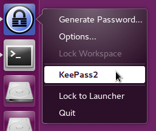
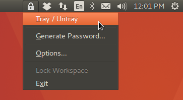
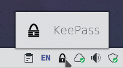
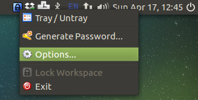
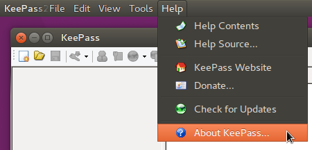

Keebuntu
========

KeePass 2.x plugins that provide Linux Desktop integration. These are
primarily targeted for Ubuntu (but can work on other distros as well).


Launcher Quicklist
==================

Takes menu items from notification tray icon and displays them in the Unity
Launcher menu.



Tested with the following desktops:

* Pantheon (elementary OS)
* Unity (Ubuntu)

#### Background

The built-in notification tray icon for KeePass does not display in the panel.
This is because the Ubuntu Unity Desktop only supports application indicator
type tray icons. This plugin provides an alternative means of accessing the
menu items of the tray icon.

#### Package

`keepass2-plugin-launcher`

#### Usage

Right-click on the KeePass 2.x icon in the launcher. You will find menu items
such as Lock/Unlock Workspace and Generate Password….


Application Indicator
=====================

Provides an application indicator tray icon for KeePass.



Tested with the following desktops:

* Cinnamon
* GNOME Shell (older versions require [appindicator plugin])
* KDE
* MATE
* Pantheon (elementary OS)
* Unity (Ubuntu)
* Xfce

[appindicator plugin]: https://extensions.gnome.org/extension/615/appindicator-support/

#### Background

The built-in notification tray icon for KeePass does not display in the panel.
This is because notification tray support for WinForms applications is broken
in Mono. Additionally, even if it did work, it would still not be displayed in
Ubuntu Unity Desktop because it only supports application indicator type tray
icons.

#### Package

`keepass2-plugin-application-indicator`

**Note:** this package conflicts with `keepass2-plugin-tray-icon` (you cannot
have both installed at the same time). Compare the usages to decide which
package you want to install.

#### Usage

Right or left-clicking the icon displays the menu. Hovering the mouse over the
icon and scrolling down with the scroll wheel will minimize KeePass to the
tray. Scrolling up will restore KeePass from the tray.


Status Notifier
===============

Provides a notification tray icon for KeePass on Plasma/KDE5.



#### Background

The built-in notification tray icon for KeePass does not display in the panel.
This is because notification tray support for WinForms applications is broken
in Mono.

#### Package

`keepass2-plugin-status-notifier` (currently only available for xenial in the beta ppa)

**Note:** this package conflicts with `keepass2-plugin-application-indicator`
and `keepass2-plugin-tray-icon` (you can only have one out of the three
installed at the same time). Compare the usages to decide which package you
want to install.

#### Usage

Left-clicking the icon trays and untrays the KeePass application. Right-clicking
the icon displays the menu.

Classic Tray Icon
=================

Provides a notification tray icon for KeePass.



Tested with the following desktops:

* Cinnamon
* MATE

Does not work with:

* Ubuntu Unity

#### Background

The built-in notification tray icon for KeePass does not display in the panel.
This is because notification tray support for WinForms applications is broken
in Mono.

#### Package

`keepass2-plugin-tray-icon`

**Note:** this package conflicts with `keepas2-plugin-application-indicator`
(you cannot have both installed at the same time). Compare the usages to decide
which package you want to install.

#### Usage

Left-clicking the icon will activate the KeePass window. Right-clicking the
icon displays the menu.


Application Menu
================

Shows the KeePass application menu in the panel instead of the application
window. **Note:** This only works on Unity - not other desktops.



#### Background

Most applications, when used in the Ubuntu Unity desktop, have their menus
shown in a common area in the panel rather than in the application window.

#### Package

`keepass2-plugin-application-menu`

#### Usage

Setting the environment variable `APPMENU_DISPLAY_BOTH=1` before starting
KeePass will show the menu both on the panel and in the KeePass application
window.


-----


Binary Packages
===============

On Ubuntu and derivative systems, you can install via ppa:

```
sudo apt-add-repository ppa:dlech/keepass2-plugins
sudo apt-get update
sudo apt-get install <list-of-package-names>
```

The latest versions are in the beta ppa:
```
sudo apt-add-repository ppa:dlech/keepass2-plugins-beta
sudo apt-get update
sudo apt-get install <list-of-package-names>
```

On Arch Linux, you can try https://aur.archlinux.org/packages/keebuntu-git/ (outdated)
